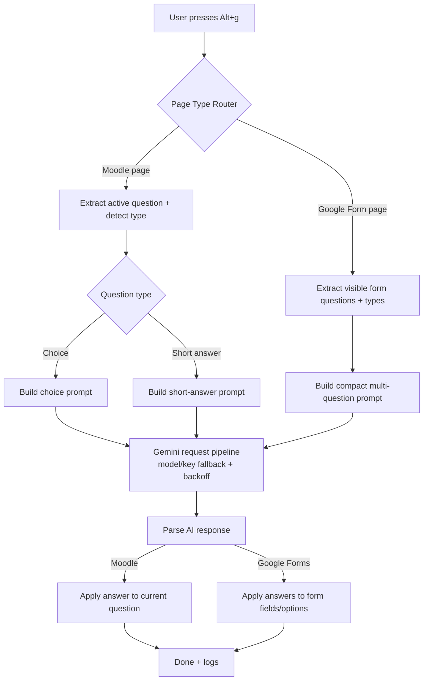

# Spach

[](https://github.com/Anas-github-acc/spach/stargazers)
[](https://github.com/Anas-github-acc/spach/network/members)
[](https://github.com/Anas-github-acc/spach/graphs/contributors)

Spach is a browser extension designed to help solve online quizzes. It currently supports Moodle and Google Forms, where it reads questions directly from the page and uses AI to choose and fill the most likely correct answers.

The goal of Spach is to make quiz assistance fast and practical inside the browser, without requiring users to copy and paste questions manually.

## How It Works

When you open a supported quiz page, the extension detects visible questions, sends the relevant context to an AI model, and then fills in the predicted answers automatically.

## Unified Trigger

Spach now uses a single shortcut across supported pages:

- `Alt + g`

What happens when you press `Alt + g`:

- On Moodle: it extracts the current question, detects its type (`choice` or `short-answer`), asks AI for the answer, and fills the result.
- On Google Forms: it extracts visible questions in the current chunk, asks AI for structured answers, and fills them.

## Architecture Diagram



## Setup

To get started, clone this repository and open `config.js`. Add your primary API key in the `apiKey` field:

```js
const apiKey = "YOUR_API_KEY";
```

You can also add fallback keys and adjust model names in the same file if needed. After configuration, open your browser's extension page (for example, `chrome://extensions`), enable Developer mode, and choose Load unpacked to load this project folder. Once loaded, open a supported Moodle or Google Forms quiz page and use the extension.

## Roadmap

We plan to add local model support in a future release so users can run Spach with more flexibility and reduced dependency on cloud APIs.
